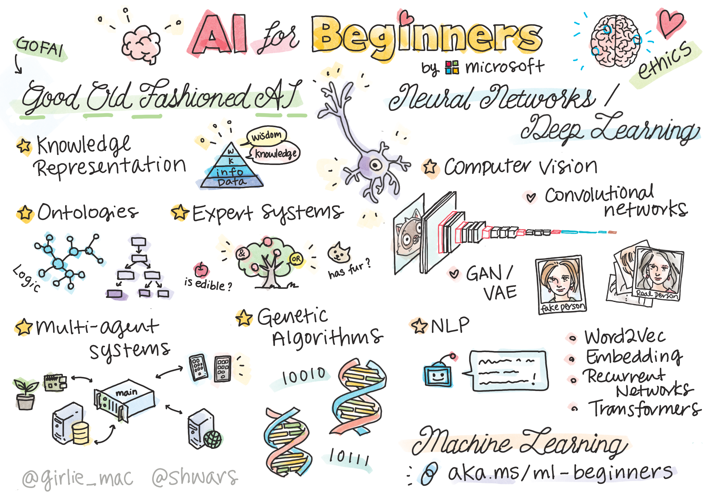

This post will explore the definition of AI, its various types, introduce its main subfields, and provide resources for a comprehensive understanding of artificial intelligence.

## Artificial Intelligence (AI) Definition

When defining and talking about AI, it's important to be cautious, as many commonly used terms can be misleading. Words like learning, understanding, and intelligence are “suitcase words” — they carry multiple meanings that come along even if we intend only one of them 1.

<!-- The AI definition largely depends on how one interprets the concept of intelligence itself. Some define it as the ability to replicate human performance, while for others it is equivalent to rationality, understood as doing the “right thing”. Additionally, ome view intelligence as rooted in internal thought processes and reasoning, while others emphasize observable intelligent behavior as its defining feature.
 2.

However, the rational-agent approach to AI offers a major advantage: rationality can be precisely and universally defined in mathematical terms and consequently, it supports scientific progress more effectively. Designing agents to meet rational criteria is easier than trying to mimic human thought or behavior, which is why this approach has become the dominant AI paradigm over time. -->

The AI definition largely depends on how one interprets the concept of intelligence itself. Some define it as rationality, understood as doing the “right thing”. This rational approach has become the dominant AI paradigm over time since it is offers a major advantage: rationality can be precisely and universally defined in mathematical terms and consequently, it supports scientific progress more effectively. Designing agents to meet rational criteria is easier than trying to mimic human thought or behavior 2. 

<!-- ## History of AI 

Capitulo 1 del libro - muy interesante! o meniconar al final de subfields apartado -->

## Types of AI

To gain a clearer understanding of what AI and where we currently stand in its development, it’s helpful to know that AI is categorized into three main types according to its capabilities 3:

**- Narrow AI (Weak AI):** 
    The only form of AI that currently exists, which is limited to specific tasks. Some examples are Siri, Alexa and even ChatGPT.
**- General AI (Strong AI):** 
    AGI would apply prior knowledge to new tasks across contexts without needing human intervention.
**- Superintelligent AI:** 
    like AGI, is strictly theoretical. If ever realized, Super AI would evolved to possess beliefs and desires of their own.

The following video gives a more detailed explanation of this classification:

     

## Overview AI Subfields

If you’re reading this blog, you’ve probably already heard of terms 'machine learning' (ML) and 'deep learning' (DL). In fact, much of AI’s recent boom in the media and industry is thanks to significant progress in these areas.

 It is important to emphasize that ML is a subfield of AI focused on enabling systems to improve performance through experience, not all the AI systems rely on machine learning. DL is a broad family of techniques for machine learning.

These fields relate to AI in a simplified way as follows:

For further information, please check the following video:

     

 AI is more than just ML and DL, it’s a broad field that includes subfields like robotics and computer vision, overlaps with areas like statistics and data science, and is closely related yet separated from fields such as control theory.
 
## Beginner friendly resuources

If you enjoy bedtime reading, the following free course might become your best friend for a few weeks (you can even obtain etcs): 

## Beyond the Basics 

 Once you have been acquinted with the basics of AI, you can continue your learning journey with the amazing book 'Artificial intelligence: A modern approach' 2 to gain a complete overview of this exciting field.

If you prefer a briefer overview, the following course is a very nice resource: 

Additionally, you might want to check the repository 'Spice up bioinformatics with AI' where i will be updating links of learning resources about bioinformatics and AI. 

## Bibliography 

1. University of Helsinki. (n.d.). Elements of AI. https://course.elementsofai.com

2. Russell, S., & Norvig, P. (2021). Artificial intelligence: A modern approach (4th ed.). Pearson.

3. IBM. (2023). Understanding the different types of artificial intelligence. https://www.ibm.com/think/topics/artificial‑intelligence‑types

**Did you find this page helpful? Consider sharing it 🙌**
